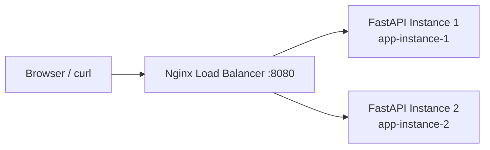
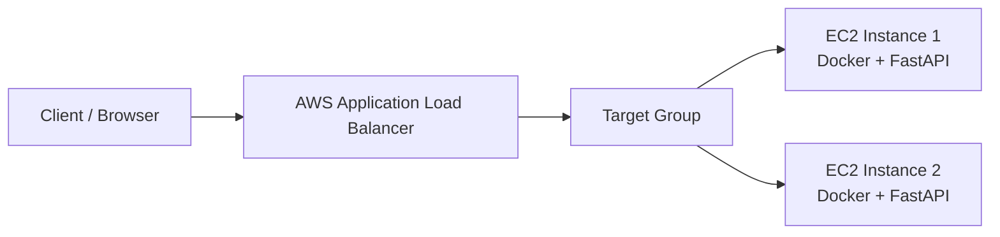

# Load-Balanced Multi-Instance App

A small **FastAPI** application deployed as two identical instances behind a load balancer. The project demonstrates **horizontal scaling**: instead of sending every request to one server, a load balancer distributes requests across multiple application instances.

**Assessment Theme:** Topic 3 — Load-balanced multi-instance app.

## What This Project Demonstrates

- Client-server architecture
- Running the same application on 2 independent instances
- Docker containerization
- Nginx reverse proxy/load balancing for local demonstration
- AWS Application Load Balancer (ALB) deployment architecture
- Health checks
- GitHub Actions CI/CD
- Automated tests that must pass before the CI job succeeds

## Architecture

### Local Docker Demonstration



Requests go to Nginx first. Nginx forwards them to `app1` or `app2`. The `/instance` endpoint returns the instance ID, making the distribution visible.

### AWS Deployment Architecture



The same Docker image is run on two EC2 instances. The AWS Application Load Balancer performs health checks and distributes incoming requests between healthy targets.

## Project Structure

```text
.
├── .github/
│   └── workflows/
│       └── ci.yml             # Tests + Docker build + load-balancer verification
├── tests/
│   └── test_api.py            # 4 automated tests
├── Dockerfile
├── docker-compose.yml          # Two app instances + Nginx
├── nginx.conf                  # Nginx upstream/load-balancing config
├── main.py                     # FastAPI application
├── requirements.txt
└── README.md
```

## Quick Start — Local

### Option 1: Docker Compose (recommended)

Prerequisites:
- Docker Desktop / Docker Engine
- Docker Compose

Run:

```bash
docker compose up --build
```

Open:

```text
http://localhost:8080
```

Swagger UI:

```text
http://localhost:8080/docs
```

Check which instance handled the request:

```bash
curl http://localhost:8080/instance
```

Run the command repeatedly. You should see responses containing either:

```json
{"instance_id":"app-instance-1", ...}
```

or:

```json
{"instance_id":"app-instance-2", ...}
```

You can also test the health endpoint:

```bash
curl http://localhost:8080/health
```

Stop everything:

```bash
docker compose down
```

## Run Without Docker

```bash
python -m venv .venv
```

Windows:

```bash
.venv\Scripts\activate
```

Linux/macOS:

```bash
source .venv/bin/activate
```

Install dependencies:

```bash
pip install -r requirements.txt
```

Run the application:

```bash
python main.py
```

The single local instance is available at `http://localhost:8000`.

## Running Tests

Install dependencies and run:

```bash
python -m pytest -v --cov=. --cov-fail-under=80
```

The project contains at least 4 tests:

1. Root endpoint test
2. Health-check test
3. Instance identification test
4. Burst/concurrent-style request test

The GitHub Actions workflow also builds the Docker image and starts the two-instance stack. It then sends requests through Nginx and verifies that **both instance IDs appear in the responses**.

## How Load Balancing Works

Without a load balancer:

```text
Client ───────────────> Server 1
```

With horizontal scaling:

```text
                         ┌──> Server 1
Client ──> Load Balancer ┤
                         └──> Server 2
```

The load balancer acts as the single entry point. It chooses a healthy backend for each incoming request. If one backend becomes unavailable, a properly configured load balancer can stop routing new requests to that unhealthy target.

## AWS Deployment — 2 EC2 Instances + ALB

This is the deployment model required by Topic 3 of the assessment.

### Prerequisites

- AWS account
- AWS EC2 access
- Docker installed on both EC2 instances
- AWS VPC with a subnet configuration suitable for an Application Load Balancer
- Security groups

### 1. Launch Two EC2 Instances

Create two EC2 instances using the same AMI and a suitable instance size for the demonstration.

Example logical names:

```text
load-balanced-app-1
load-balanced-app-2
```

Install Docker on both machines according to the Docker documentation for the selected operating system.

### 2. Get the Project on Both Instances

Clone the repository on each EC2 instance:

```bash
git clone YOUR_GITHUB_REPOSITORY_URL
cd load-balanced-multi-instance-app
```

Build the image:

```bash
docker build -t load-balanced-app .
```

### 3. Run Different Instance IDs

On EC2 instance 1:

```bash
docker run -d \
  --name app \
  -e INSTANCE_ID=ec2-instance-1 \
  -p 8000:8000 \
  load-balanced-app
```

On EC2 instance 2:

```bash
docker run -d \
  --name app \
  -e INSTANCE_ID=ec2-instance-2 \
  -p 8000:8000 \
  load-balanced-app
```

Verify each instance directly:

```bash
curl http://localhost:8000/instance
```

The responses should identify the respective EC2 instance.

### 4. Create an AWS Target Group

In the AWS EC2 console:

1. Create a **Target Group** for the two EC2 instances.
2. Choose **Instances** as the target type.
3. Use HTTP protocol and port `8000`.
4. Configure the health-check path as:

```text
/health
```

5. Register both EC2 instances.

The target group should eventually show both instances as healthy.

### 5. Create an Application Load Balancer

Create an **Application Load Balancer** and configure:

- Internet-facing, if you want to demonstrate it publicly
- HTTP listener on port `80`
- Forwarding rule to the target group created above

The traffic flow becomes:

```text
Browser
   |
   v
Application Load Balancer
   |
   v
Target Group
  / \
 /   \
v     v
EC2-1 EC2-2
```

### 6. Security Groups

For a simple classroom demonstration, configure security groups carefully so that:

- The ALB accepts HTTP traffic on port `80`.
- The EC2 instances accept port `8000` from the ALB security group.
- SSH port `22` is restricted to your administration IP rather than opened to everyone.

Do not expose unnecessary ports publicly.

### 7. Test the Load Balancer

Copy the ALB DNS name from AWS and open:

```text
http://YOUR_ALB_DNS/instance
```

Refresh/send multiple requests. The response should identify different instances over repeated requests, for example:

```text
ec2-instance-1
```

and

```text
ec2-instance-2
```

The exact request-to-instance sequence is controlled by the load balancer and should not be assumed to alternate perfectly.

## CI/CD

GitHub Actions runs on pushes and pull requests to `main`.

The workflow:

1. Checks out the code.
2. Installs Python dependencies.
3. Runs pytest with coverage.
4. Fails if coverage falls below 80%.
5. Builds the Docker image.
6. Starts two application containers and Nginx.
7. Checks the load balancer health endpoint.
8. Sends repeated requests through Nginx.
9. Verifies that both application instance IDs are reachable.
10. Shuts down the test containers.

### Blocking Failed Code

The workflow reports failure when tests, coverage, Docker build, or load-balancer verification fails. To **block merging code that fails CI**, enable GitHub branch protection/rulesets for `main` and require the CI check to pass before merging.

## Presentation — 2 to 3 Minutes

### 1. Problem — 20 seconds

A single server can become a bottleneck or a single point of failure as traffic increases.

### 2. Solution — 40 seconds

Run multiple copies of the same application and put a load balancer in front of them. The load balancer distributes requests between healthy instances.

### 3. Live Demo — 60 seconds

Show:

```text
http://localhost:8080/instance
```

Refresh or send multiple requests and point out that the response contains different instance IDs.

Then show the Docker containers:

```bash
docker compose ps
```

### 4. Architecture — 30 seconds

Explain:

```text
Client → Load Balancer → Instance 1
                     └→ Instance 2
```

For AWS:

```text
Client → ALB → Target Group → EC2-1 / EC2-2
```

### 5. Key Learning — 20 seconds

- Horizontal scaling means adding more application instances.
- A load balancer provides a single entry point and distributes traffic.
- Health checks prevent traffic from being sent to unhealthy targets.
- Containers make the application reproducible across machines.
- CI verifies the project before code is accepted.

## Submission Checklist

- [x] Topic 3: Load-balanced multi-instance application
- [x] Two application instances
- [x] Load balancer configuration
- [x] Docker containerization
- [x] At least 4 automated tests
- [x] GitHub Actions CI
- [x] CI verifies both instances through the load balancer
- [x] Architecture diagram
- [x] Local reproduction steps
- [x] AWS EC2 + ALB deployment steps
- [ ] Push this project to your public GitHub repository
- [ ] Enable branch protection/rulesets requiring CI to pass
- [ ] Deploy to AWS before the presentation
- [ ] Demonstrate the running application in class

## Assessment Alignment

This project follows the supplied assessment requirement for Topic 3: deploy the same simple application across two or more instances/containers behind a load balancer and demonstrate that requests are distributed, illustrating horizontal scaling and the client-server paradigm.
